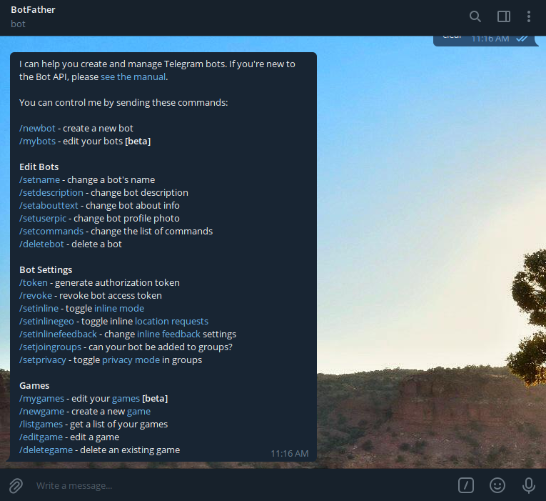
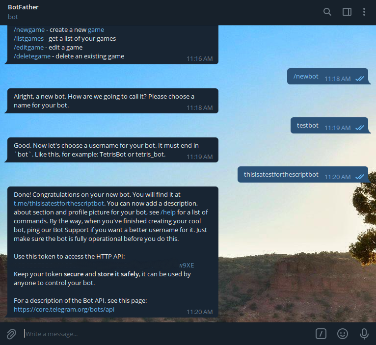

# cowin-alerts
Simple python script when used with cron, sends automated telegram messages to alert about available [Cowin](https://www.cowin.gov.in/) appointment slots.

### How does it work?
The python script is executed on a desired schedule using cron or Windows' scheduled tasks. It pings Cowin's server and looks for any vaccination center with available slots. Upon receiving successful response from Cowin, the script sends out telegram messages to your configured group / channel / user.


The message is sent out in the following format:

```
Name of the vaccination center

Address: 
Pincode: 
Date: 
Time: 
Vaccine: 
Type: 
Fee: 
Age Limit: 
Available doses: 
  Dose 1: 
  Dose 2:
```

Example:

```
KDMCG ATRE RANGMANDIR NATYAGRU

Address: SHIVAJI CHOWK BAZAR PETH NEAR SUBHASH MAIDAN BHOIWADA KALYAN WEST
Pincode: 421301
Date: 11-08-2021
Time: 10:00:00-17:00:00
Vaccine: COVAXIN
Type: Free
Fee: 0
Age Limit: 18
Available doses: 98
  Dose 1: 0
  Dose 2: 98
```
### Requirements

1. Python3


2. Python packages:

   `telegram_send==0.25` (_If you want the bot to send you messages personally_)<br />
   `requests==2.26.0` <br /><br />
3. Preferably a Linux based computer (Even a simple raspberry pi would do). Windows gives weird errors with scheduled tasks.


4. [Cron](https://stackoverflow.com/questions/1802337/how-to-install-cron) on linux. On Windows, you can use [scheduled tasks](https://www.windowscentral.com/how-create-automated-task-using-task-scheduler-windows-10).


5. Stable and 24x7 internet connection (_Setup on a cloud instance if you can_)


6. Telegram bot
   1. Open [botfather](https://t.me/botfather) chat in telegram messenger.<br /><br /><br /><br />
   
   2. Select `/newbot` command and set a name and username for your new bot (username of your bot should end with `bot`).<br /><br /><br /><br />
   3. Copy the api token of your bot.


### Usage

1. Check if you have git installed on your computer using `git --version`. You should get an output with the version of git installed on your computer: `git version 2.25.1`
   
   [Install git](https://git-scm.com/book/en/v2/Getting-Started-Installing-Git) if not installed.


2. Clone the repository using following command in a suitable directory on your computer.:<br />
   `git clone https://github.com/yashimself/cowin-alerts.git` <br /><br />
3. Open a terminal in the cloned folder and install the requirements:<br />`pip install -r requirements.txt`<br /><br />
4. Open the `secret.py` file in the cloned folder, and paste the api token of your bot that you copied earlier in front of `api` variable.<br />
   e.g: `api = 'your bot api inside the quotes'`<br /><br />
5. Now, visit [telegram web](https://web.telegram.org/) and open the chat where you would like the bot to send alerts. If it's a channel or group, you have to first add the bot in the respective channel / group and allow it to access messages in the permissions settings.<br /> After opening your desired channel / group chatbox, copy the chat id displayed in the url bar.<br/><br />The id is entire integer string including the preceding`-`<br />e.g: `-1234567890`<br/><br/>
   1. Paste the chat id in the `secret.py` file in front of `chat` variable after `-100`.<br />
      e.g: `chat='-1001234567890'`<br/><br/>You can add multiple chat id variables if you want the bot to send alerts in multiple groups / channels.<br/><br/>
6. Open the `main.py` file and add the pincode(s) for which you want alerts in the `pincodes` list on line number `9`.<br/><br/>
7. Save the file. Execute the file using command `python3 main.py` to check if it's working as desired.<br/><br/>
8. Now, set up a cronjob for this script. A cronjob will execute this script at your desired schedule.<br/><br/>
   1. On linux, open a terminal and execute following command:<br/>`crontab -e`<br/><br/>
   2. If this is your first time using cron, it'll ask for an editor to choose. Select nano by typing `1` in the cli and press enter / return.<br/><br/>
   3. At the end of the file, paste the following line with path to your script:<br/>
      `0 19 * * * <path to your python file>`<br/><br/>
      This line will execute the script daily at 07:00 p.m.<br/><br/>
   4. You can customise this according to your need and convenience. [Crontab guru](https://crontab.guru/) is a great place to play around with cron commands.<br/><br/>
   5. Press `Ctrl+X` and press `Enter / return` to save and exit the file.<br/><br/>

Congratulations! You've successfully set up an automated alert system for cowin appointment slots. 